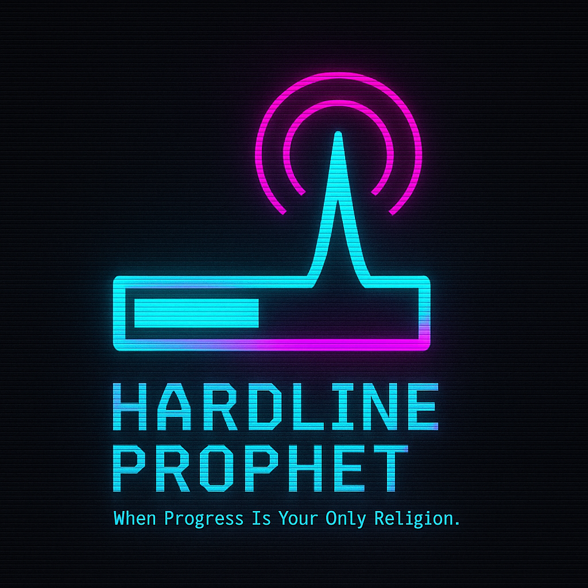

## Logo

**Hardline Prophet**  
*When Progress Is Your Only Religion.*

# Hardline Prophet — Game Design Document (GDD)

## 1. Introduction

### 1.1 Purpose
This document outlines the design for **Hardline Prophet**, a cyberpunk-themed idle/CLI-driven progression game. It serves as the single source of truth for vision, mechanics, UI flow, and technical requirements.

> [!NOTE]
> Everything in this file lives in your `README.md`, so updates here will reflect immediately for users and contributors.

### 1.2 Audience
- Players who enjoy atmospheric, narrative-lite cyberpunk experiences.  
- Developers and designers collaborating on the Hardline Prophet project.

### 1.3 Scope
Covers core gameplay loop, progression systems, UI/UX sketches (ASCII/CLI), save/load architecture, and the splash/menu flows.

---

## 2. Vision Statement
"When Progress Is Your Only Religion." Hardline Prophet immerses players in a dystopian net-runner’s journey, where every action pulses through the undercity’s data streams and shapes your fate.

---

## 3. Core Gameplay Concept

- **Progress Loop:** Idle/automated missions (data heists, black-market trades) advance the progress bar.  
- **Interventions:** Player can choose to upgrade cyberware, adjust script parameters, or accept riskier jobs for higher reward.  
- **Narrative Strobes:** Occasional flavor text and world-state changes appear between cycles.

> [!TIP]
> Use modular mission generators so you can add new job types without touching core loop logic.

---

## 4. Gameplay Loop

1. **Splash & Menu:** Neon‑glitch intro → Main menu (Logon/Logoff/Shutdown).  
2. **Logon (Load):** Prompt username/password → Validate credentials → Load saved profile.  
3. **Idle Progress:** Progress bar fills automatically over time; status messages log mission outcomes.  
4. **Player Actions:** At any time, access Actions menu to:  
   - Upgrade Implants (spend credits)  
   - Accept Special Job (one‑off quest)  
5. **Logoff (Save):** Saves current profile state to disk.  
6. **Shutdown:** Auto‑save then exit.

> [!WARNING]
> Shutting down without logging off will still auto-save, but interrupting during file write may corrupt the save. Always wait for confirmation.

---

## 5. UI & Controls

- **CLI/Terminal.Gui Layout:**  
  - **MenuBar**: Actions → Logon, Logoff, Shutdown  
  - **Status Window**: Displays progress bar, mission logs, and system messages.  
  - **Input Prompts**: Pop‑up dialogs for credentials, confirmations, and upgrade selections.

> [!CAUTION]
> Avoid placing blocking dialogs on top of ongoing animations—they can cause flicker on some terminals.

---

## 6. Progression & Upgrades

- **Stats:** HackSpeed, Stealth, DataYield  
- **Upgrades:** Cyberdeck, Neural Accelerator, Signal Scrambler  
- **Currency:** Credits earned per cycle, spent on upgrades.

> [!TIP]
> Balance upgrade costs to encourage strategic choices—early tiers should feel affordable, later tiers should require real planning.

---

## 7. Save/Load Architecture

> [!IMPORTANT]
> Always validate the user’s credentials before loading a save file to prevent unauthorized access.

- **File Format:** JSON per user: `{ username }.save.json`  
- **On Logon:** Read file into in‑memory `GameState` object.  
- **On Logoff/Shutdown:** Serialize `GameState` back to JSON.

> [!TIP]
> Keep your `GameState` schema backwards‑compatible by versioning the JSON and providing migration logic.

---

## 8. Technical Requirements

- **Tech Stack:** .NET 8, Terminal.Gui, Spectre.Console  
- **Persistence:** Local JSON files  
- **Testing:** xUnit + NFluent for unit tests on save/load, progression logic

> [!CAUTION]
> Ensure your .NET runtime matches your target framework (net8.0); mismatches can lead to unexpected crashes.

---

## 9. Future Considerations

- Add multiplayer leaderboards (upload stats)  
- Thematic seasonal events (modular content)  
- Expand flavor text narrative modules

> [!NOTE]
> This section is a living list—feel free to propose and link new features here as issues or PRs.

*End of GDD draft.*  
